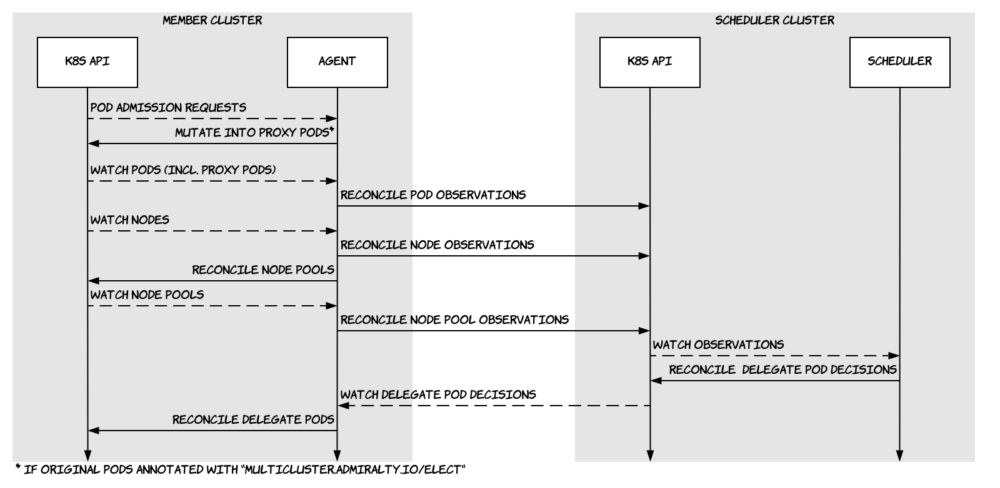

# Multicluster-Scheduler

Multicluster-scheduler is a system of Kubernetes controllers that intelligently schedules workloads across clusters. It is simple to use and simple to integrate with other tools.

1. Install the scheduler in any cluster and the agent in each cluster that you want to federate.
1. Annotate any pod or pod template (e.g., of a Deployment or [Argo](https://argoproj.github.io/argo) Workflow) in any member cluster with `multicluster.admiralty.io/elect=""`.
1. Multicluster-scheduler replaces the elected pods by proxy pods and deploys delegate pods to other clusters.
1. New in v0.3: Services that target proxy pods are rerouted to their delegates, replicated across clusters, and annotated with `io.cilium/global-service=true` to be [load-balanced across a Cilium cluster mesh](http://docs.cilium.io/en/stable/gettingstarted/clustermesh/#load-balancing-with-global-services), if installed.

Check out [Admiralty's blog post](https://admiralty.io/blog/running-argo-workflows-across-multiple-kubernetes-clusters/) demonstrating how to run an Argo workflow across clusters to better utilize resources and combine data from different regions or clouds.

## How it Works



Multicluster-scheduler is a system of Kubernetes controllers managed by the **scheduler**, deployed in any cluster, and its **agents**, deployed in the member clusters. The scheduler manages two controllers: the eponymous scheduler controller and the global service controller. Each agent manages six controllers: pod admission, service reroute, observations, decisions, feedback, and node pool.

1. The **pod admission controller**, a [dynamic, mutating admission webhook](https://kubernetes.io/docs/reference/access-authn-authz/extensible-admission-controllers/), intercepts pod creation requests. If a pod is annotated with `multicluster.admiralty.io/elect=""`, its original manifest is saved as an annotation, and its containers are replaced by **proxies** that simply await success or failure signals from the feedback controller (see below).
1. The **service reroute controller** modifies services whose endpoints target proxy pods. The keys of their label selectors are prefixed with `multicluster.admiralty.io/`, to match corresponding **delegate** pods (see below). Also, the services are annotated with `io.cilium/global-service=true`, to be load-balanced across a Cilium cluster mesh.
1. The **observations controller**, a [multi-cluster controller](https://github.com/admiraltyio/multicluster-controller), watches pods (including proxy pods), services (including global services), nodes, and node pools (created by the node pool controller, see below) in the agent's cluster and reconciles corresponding **observations** in the scheduler's cluster. Observations are images of the source objects' states.
1. The **scheduler** watches proxy pod observations and reconciles delegate pod **decisions**, all in its own cluster. It decides target clusters based on the other observations. The scheduler doesn't push anything to the member clusters.
1. The **global service controller** watches global service observations (observations of services annotated with `io.cilium/global-service=true`, either by the service reroute controller or by another tool or user) and reconciles global service decisions (copies of the originals), in all clusters of the federation.
1. The **decisions controller**, another multi-cluster controller, watches pod and service decisions in the scheduler's cluster and reconciles corresponding delegates in the agent's cluster.
1. The **feedback controller** watches delegate pod observations and reconciles the corresponding proxy pods. If a delegate pod is annotated (e.g., with Argo outputs), the annotations are replicated upstream, into the corresponding proxy pod. When a delegate pod succeeds or fails, the controller kills the corresponding proxy pod's container with the proper signal. The feedback controller maintains the contract between proxy pods and their controllers, e.g., replica sets or Argo workflows.
1. The **node pool controller** automatically creates **node pool** objects in the agent's cluster. In GKE and AKS, it uses the `cloud.google.com/gke-nodepool` or `agentpool` label, respectively; in the absence of those labels, a default node pool object is created. Min/max node counts and pricing information can be updated by the user, or controlled by other tools. Custom node pool objects can also be created using label selectors. Node pool information can be used for scheduling.

Observations, decisions, and node pools are [custom resources](https://kubernetes.io/docs/concepts/extend-kubernetes/api-extension/custom-resources/). Node pools are defined (by CRDs) in each member cluster, whereas all observations and decisions are only defined in the scheduler's cluster.

## Getting Started

We assume that you are a cluster admin for two clusters, associated with, e.g., the contexts "cluster1" and "cluster2" in your kubeconfig. We're going to install a basic scheduler in cluster1 and agents in cluster1 and cluster2, but the scripts can easily be adapted for other configurations. Then, we will deploy a multi-cluster NGINX.

```bash
CLUSTER1=cluster1 # change me
CLUSTER2=cluster2 # change me
```

### Installation

#### Optional: Cilium cluster mesh

For cross-cluster service calls, multicluster-scheduler relies on a Cilium cluster mesh and global services. If you need this feature, [install Cilium](http://docs.cilium.io/en/stable/gettingstarted/#installation) and [set up a cluster mesh](http://docs.cilium.io/en/stable/gettingstarted/clustermesh/). If you install Cilium later, you may have to restart pods.

#### Scheduler

Choose a cluster to host the scheduler, download the basic scheduler's manifest and install it:

```bash
SCHEDULER_CLUSTER_NAME="$CLUSTER1"
RELEASE_URL=https://github.com/admiraltyio/multicluster-scheduler/releases/download/v0.3.0
kubectl config use-context "$SCHEDULER_CLUSTER_NAME"
kubectl apply -f "$RELEASE_URL/scheduler.yaml"
```

#### Federation

In the same cluster as the scheduler, create a namespace for the federation and, in it, a service account and role binding for each member cluster. The scheduler's cluster can be a member too.

```bash
FEDERATION_NAMESPACE=foo
kubectl create namespace "$FEDERATION_NAMESPACE"
MEMBER_CLUSTER_NAMES=("$CLUSTER1" "$CLUSTER2") # Add as many member clusters as you want.
for CLUSTER_NAME in "${MEMBER_CLUSTER_NAMES[@]}"; do
    kubectl create serviceaccount "$CLUSTER_NAME" \
        -n "$FEDERATION_NAMESPACE"
    kubectl create rolebinding "$CLUSTER_NAME" \
        -n "$FEDERATION_NAMESPACE" \
        --serviceaccount "$FEDERATION_NAMESPACE:$CLUSTER_NAME" \
        --clusterrole multicluster-scheduler-member
done
```

#### Multicluster-Service-Account

If you're already running [multicluster-service-account](https://github.com/admiraltyio/multicluster-service-account) in each member cluster, and the scheduler's cluster is known to them as `$SCHEDULER_CLUSTER_NAME`, you can skip this step and [install the agents](#agent). Otherwise, read on.

Download the multicluster-service-account manifest and install it in each member cluster:

```bash
MCSA_RELEASE_URL=https://github.com/admiraltyio/multicluster-service-account/releases/download/v0.3.0
for CLUSTER_NAME in "${MEMBER_CLUSTER_NAMES[@]}"; do
    kubectl --context "$CLUSTER_NAME" apply -f "$MCSA_RELEASE_URL/install.yaml"
done
```

Then, download the kubemcsa binary and run the bootstrap command to allow member clusters to import service accounts from the scheduler's cluster:

```bash
OS=linux # or darwin (i.e., OS X) or windows
ARCH=amd64 # if you're on a different platform, you must know how to build from source
curl -Lo kubemcsa "$MCSA_RELEASE_URL/kubemcsa-$OS-$ARCH"
chmod +x kubemcsa
sudo mv kubemcsa /usr/local/bin

for CLUSTER_NAME in "${MEMBER_CLUSTER_NAMES[@]}"; do
    kubemcsa bootstrap "$CLUSTER_NAME" "$SCHEDULER_CLUSTER_NAME"
done
```

#### Agent

Download the agent manifest and install it in each member cluster:

```bash
curl -LO $RELEASE_URL/agent.yaml
for CLUSTER_NAME in "${MEMBER_CLUSTER_NAMES[@]}"; do
    sed -e "s/SCHEDULER_CLUSTER_NAME/$SCHEDULER_CLUSTER_NAME/g" \
        -e "s/FEDERATION_NAMESPACE/$FEDERATION_NAMESPACE/g" \
        -e "s/CLUSTER_NAME/$CLUSTER_NAME/g" \
        agent.yaml > "agent-$CLUSTER_NAME.yaml"
    kubectl --context "$CLUSTER_NAME" apply -f "agent-$CLUSTER_NAME.yaml"
done
```

Check that node pool objects have been created in the agents' clusters and observations appear in the scheduler's cluster:

```bash
for CLUSTER_NAME in "${MEMBER_CLUSTER_NAMES[@]}"; do
    kubectl --context "$CLUSTER_NAME" get nodepools # or np
done
kubectl -n "$FEDERATION_NAMESPACE" get nodepoolobservations # or npobs
kubectl -n "$FEDERATION_NAMESPACE" get nodeobservations # or nodeobs
kubectl -n "$FEDERATION_NAMESPACE" get podobservations # or podobs
kubectl -n "$FEDERATION_NAMESPACE" get serviceobservations # or svcobs
# or, by category
kubectl -n "$FEDERATION_NAMESPACE" get observations --show-kind # or obs
```

### Example

Multicluster-scheduler's pod admission controller operates in namespaces labeled with `multicluster-scheduler=enabled`. In any of the member cluster, e.g., cluster2, label the `default` namespace. Then, deploy NGINX in it with the election annotation on the pod template:

```bash
kubectl --context "$CLUSTER2" label namespace default multicluster-scheduler=enabled
cat <<EOF | kubectl --context "$CLUSTER2" apply -f -
apiVersion: apps/v1
kind: Deployment
metadata:
  name: nginx
spec:
  replicas: 10
  selector:
    matchLabels:
      app: nginx
  template:
    metadata:
      labels:
        app: nginx
      annotations:
        multicluster.admiralty.io/elect: ""
    spec:
      containers:
      - name: nginx
        image: nginx
        resources:
          requests:
            cpu: 100m
            memory: 32Mi
        ports:
        - containerPort: 80
EOF
```

Things to check:

1. The original pods have been transformed into proxy pods. Notice the replacement containers, and the original manifest saved as an annotation.
1. Proxy pod observations have been created in the scheduler's cluster. Notice their names indicating the proxy pods' cluster name, namespace and names. This information is also stored in `status.liveState.metadata`.
1. Delegate pod decisions have been created in the scheduler's cluster as well. Delegate pod decisions are named after the proxy pod observations, but the cluster names in `spec.template.metadata` don't necessarily match because they indicate the target clusters. Each decision was made based on all of the observations available at the time.
1. Delegate pods have been created in either cluster. Notice that their spec matches the original manifest.

```bash
kubectl --context "$CLUSTER2" get pods # (-o yaml for details)
kubectl -n "$FEDERATION_NAMESPACE" get podobs # (-o yaml)
kubectl -n "$FEDERATION_NAMESPACE" get poddecisions # or poddec (-o yaml)
for CLUSTER_NAME in "${MEMBER_CLUSTER_NAMES[@]}"; do
    kubectl --context "$CLUSTER_NAME" get pods # (-o yaml)
done
```

### Enforcing Placement

In some cases, you may want to specify the target cluster, rather than let the scheduler decide. For example, you may want an Argo workflow to execute certain steps in certain clusters, e.g., to be closer to external dependencies. You can enforce placement using the `multicluster.admiralty.io/clustername` annotation. [Admiralty's blog post](https://admiralty.io/blog/using-admiralty-s-multicluster-scheduler-to-run-argo-workflows-across-kubernetes-clusters) presents multicloud Argo workflows. To complete this getting started guide, let's annotate our NGINX deployment's pod template to reschedule all pods to cluster1.

```bash
kubectl --context "$CLUSTER2" patch deployment nginx -p '{
  "spec":{
    "template":{
      "metadata":{
        "annotations":{
          "multicluster.admiralty.io/clustername":"'$CLUSTER1'"
        }
      }
    }
  }
}'
```

After a little while, delegate pods in cluster2 will be terminated and more will be created in cluster1.

### Optional: Service Reroute and Globalization

Our NGINX deployment isn't much use without a service to expose it. [Kubernetes services](https://kubernetes.io/docs/concepts/services-networking/service/) route traffic to pods based on label selectors. We could directly create a service to match the labels of the delegate pods, but that would make it tightly coupled with multicluster-scheduler. Instead, let's create a service as usual, targeting the proxy pods. If a proxy pod were to receive traffic, it wouldn't know how to handle it, so multicluster-scheduler will change the service's label selector for us, to match the delegate pods instead, whose labels are similar to those of the proxy pods, except that their keys are prefixed with `multicluster.admiralty.io/`.

If some or all of the delegate pods are in a different cluster, we also need the service to route traffic to them. For that, we rely on a Cilium cluster mesh and global services. Multicluster-scheduler will annotate the service with `io.cilium/global-service=true` and replicate it across clusters. (Multicluster-scheduler replicates any global service across clusters, not just services targeting proxy pods.)

```bash
kubectl --context "$CLUSTER2" expose deployment nginx
```

We just created a service in cluster2, alongside our deployment. However, in the previous step, we rescheduled all NGINX pods to cluster1. Check that the service was rerouted, globalized, and replicated to cluster1:

```bash
kubectl --context "$CLUSTER2" get service nginx -o yaml
# Check the annotations and the selector,
# then check that a copy exists in cluster1:
kubectl --context "$CLUSTER1" get service nginx -o yaml
```

Now call the delegate pods in cluster1 from cluster2:

```bash
kubectl --context "$CLUSTER2" run foo -it --rm --image alpine --command -- sh -c "apk add curl && curl nginx"
```

## Comparison with Federation v2

The goal of [Federation v2](https://github.com/kubernetes-sigs/federation-v2) is similar to multicluster-scheduler's. However, they differ in several ways:

- Federation v2 has a broader scope than multicluster-scheduler. Any resource can be federated and deployed via a single control plane, even if the same result could be achieved with continuous delivery, e.g., GitOps. Multicluster-scheduler focuses on _scheduling_.
- Multicluster-scheduler doesn't require using new federated resource types (cf. Federation v2's templates, placements and overrides). Instead, pods only need to be annotated to be scheduled to other clusters. This makes adopting multicluster-scheduler painless and ensures compatibility with other tools like Argo.
- Whereas Federation v2's API resides in a single cluster, multicluster-scheduler's annotated pods can be declared in any member cluster and/or the scheduler's cluster. Teams can keep working in separate clusters, while utilizing available resources in other clusters as needed. 
- Federation v2 propagates scheduling resources with a push-sync reconciler. Multicluster-scheduler's agents push observations and pull scheduling decisions to/from the scheduler's cluster. The scheduler reconciles scheduling decisions with observations, but never calls the Kubernetes APIs of the member clusters. Clusters allowing outbound traffic to, but no inbound traffic from the scheduler's cluster (e.g., on-prem, in some cases) can join the federation. Also, if the scheduler's cluster is compromised, attackers don't automatically gain access to the entire federation.
- Federation v2 integrates with [ExternalDNS](https://github.com/kubernetes-incubator/external-dns) to provide [cross-cluster service discovery](https://github.com/kubernetes-sigs/federation-v2/blob/master/docs/servicedns-with-externaldns.md) and [multicluster ingress](https://github.com/kubernetes-sigs/federation-v2/blob/master/docs/ingressdns-with-externaldns.md). Multicluster-scheduler doesn't solve multicluster ingress at the moment, but integrates with Cilium for cross-cluster service discovery, and [everything else Cilium has to offer](https://cilium.readthedocs.io/en/latest/intro/). A detailed comparison of the two approaches is beyond the scope of this README (but certainly worth a future blog post).

## Roadmap

- [x] [Integration with Argo](https://admiralty.io/blog/running-argo-workflows-across-multiple-kubernetes-clusters/)
- [x] Integration with Cilium cluster mesh and global services
- [ ] Alternative cross-cluster networking implementations: Istio (1.1), Submariner
- [ ] More integrations: Horizontal Pod Autoscaler, Knative, Rook, k3s, kube-batch
- [ ] Advanced scheduling, respecting affinities, anti-affinities, taints, tolerations, quotas, etc.
- [ ] Port-forward between proxy and delegate pods
- [ ] One namespace per member cluster in the scheduler's cluster for more granular RBAC
- [ ] Integrate node pool concept with other tools

## Bring Your Own Scheduler

You can easily implement your own multi-cluster scheduler. Here's a basic manager scaffolding, where the custom `scheduler` struct, which implements the [`Scheduler` interface](https://godoc.org/admiralty.io/multicluster-scheduler/pkg/controllers/schedule#Scheduler), is passed as an argument to the controller:

```go
package main

import (
  "log"

  "admiralty.io/multicluster-controller/pkg/cluster"
  "admiralty.io/multicluster-controller/pkg/manager"
  "admiralty.io/multicluster-scheduler/pkg/apis/multicluster/v1alpha1"
  "admiralty.io/multicluster-scheduler/pkg/controllers/schedule"
  "admiralty.io/multicluster-service-account/pkg/config"
  appsv1 "k8s.io/api/apps/v1"
  corev1 "k8s.io/api/core/v1"
  _ "k8s.io/client-go/plugin/pkg/client/auth/gcp"
  "k8s.io/sample-controller/pkg/signals"
)

func main() {
  cfg, _, err := config.ConfigAndNamespace()
  if err != nil {
    log.Fatalf("cannot load config: %v", err)
  }
  cl := cluster.New("", cfg, cluster.Options{})

  co, err := schedule.NewController(cl, &scheduler{})
  if err != nil {
    log.Fatalf("cannot create scheduler controller: %v", err)
  }

  m := manager.New()
  m.AddController(co)

  if err := m.Start(signals.SetupSignalHandler()); err != nil {
    log.Fatalf("while or after starting manager: %v", err)
  }
}

type scheduler struct {
    // ... e.g., structured observations
}

func (s *Scheduler) Reset() {
    // called before the setters to reinitialize internal state
}

func (s *scheduler) SetNodePool(np *v1alpha1.NodePool) {
    // ... e.g., store to inform scheduling decisions
    // Note: the controller has added a ClusterName to the object's metadata.
}

func (s *scheduler) SetNode(n *corev1.Node) {
    // ... e.g., store to inform scheduling decisions
    // Note: the controller has added a ClusterName to the object's metadata.
}
func (s *scheduler) SetPod(p *corev1.Pod) {
    // ... e.g., store to inform scheduling decisions
    // Note: the controller has added a ClusterName to the object's metadata.
}

func (s *scheduler) Schedule(p *corev1.Pod) (string, error) {
    // ... Given the original pod, decide a cluster name.
}
```

## API Reference

https://godoc.org/admiralty.io/multicluster-scheduler/

or

```bash
go get admiralty.io/multicluster-scheduler
godoc -http=:6060
```

then http://localhost:6060/pkg/admiralty.io/multicluster-scheduler/
