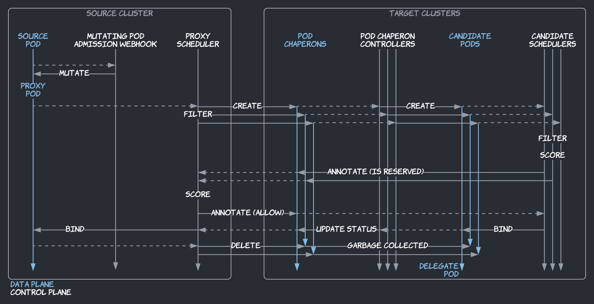
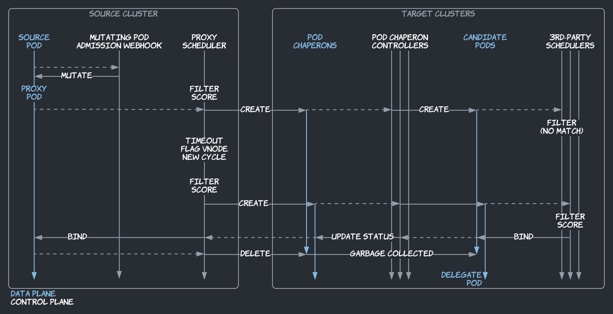

## Source Pods

Admiralty's multi-cluster scheduling feature must be enabled at the namespace level with the `multicluster-scheduler=enabled` label, and at the pod level with the `multicluster.admiralty.io/elect=""` annotation. Annotated pods in labeled namespaces are called source pods. Typically, cluster administrators label namespaces, while users annotate pod templates of, e.g., Jobs or Deployments.

## Architecture

Multi-cluster scheduling is supported by four components run by pods in Admiralty's installation namespace (typically, `admiralty`):

1. a mutating pod admission webhook,
1. the proxy scheduler,
1. the pod chaperon controller, and
1. the candidate scheduler.

For a given source pod, the mutating pod admission webhook and proxy scheduler are acting in the cluster where the source pod is created, whereas the pod chaperon controller and candidate scheduler are acting in target clusters of that source cluster.

:::info
The proxy and candidate schedulers extend the standard Kubernetes scheduler with [Scheduler Framework](https://kubernetes.io/docs/concepts/scheduling-eviction/scheduling-framework/) plugins. Therefore, they implement all standard Kubernetes scheduling features.
:::

:::caution
Admiralty's main multi-cluster scheduling algorithm is not compatible with third-party custom schedulers. That being said, if your custom scheduler is based on the Scheduler Framework as well, it shouldn't be too hard to build a new scheduler using both your plugins and the candidate scheduler's. [Please reach out for assistance](https://admiralty.io/contact).

However, if you can't modify the custom scheduler, e.g., the [AWS Fargate](../tutorials/fargate.md) scheduler, use the `multicluster.admiralty.io/no-reservation` pod annotation to use Admiralty's alternate algorithm, illustrated below, to be documented:

:::

## Proxy Pods

The mutating pod admission webhook transforms source pods into proxy pods:

1. the original manifest is saved as an annotation, to be re-used for candidate pods (see below);
1. scheduling constraints (node selector, affinity, tolerations, and topology spread constraint) are stripped and replaced to instead select and tolerate virtual nodes representing target clusters;
1. the scheduler name is set to the proxy scheduler's name—`admiralty-proxy`.

The proxy scheduler schedules and binds proxy pods to virtual nodes representing target clusters. During a proxy pod's scheduling cycle, in a plugin that filters virtual nodes, i.e., target clusters, the proxy scheduler creates a candidate pod chaperon in each target clusters (in the same namespace), and waits for the candidate scheduler in that cluster to reserve a node for the corresponding candidate pod, or not. We'll get back to this later.

## Pod Chaperons

Pod chaperons—a custom resource introduced by Admiralty—look just like pods; they have the same spec and status types as pods. They are used as intermediate objects between proxy pods and candidate pods. To create each candidate pod chaperon, the proxy scheduler:

- uses the source pod's original spec (saved as annotation on the proxy pod), and
- sets the scheduler name to the candidate scheduler's name—`admiralty-candidate`.

The pod chaperon controller of each target cluster then creates a candidate pod using the same spec. Later on, the controller also updates the status and annotations of the pod chaperon from the status of the candidate pod. And if the candidate pod is deleted directly (not because the proxy pod was deleted), e.g., if its is evicted or preempted, the controller will ensure that it is replaced, even if the connection between the source and target cluster is interrupted.

:::info
In target clusters, source cluster identities are only allowed to interact with pod chaperons, not pods directly, so they cannot read/write non-candidate pods. This follows the principle of least privilege.
:::

## Candidate Pods

The candidate scheduler of each target cluster schedules candidate pods to regular nodes (most likely "real" nodes representing virtual machines, if not other virtual nodes handled by third-party systems, e.g., Fargate).

At the end of a candidate pod's scheduling cycle, in a plugin run after (and if) a node has been reserved (filtered, scored, but not bound yet), the candidate scheduler annotates the pod chaperon with `multicluster.admiralty.io/is-reserved=true` to notify the proxy scheduler in the source cluster, waiting in its filter plugin (see above), that the virtual node representing that target cluster is a potential match for the proxy pod.

If the candidate pod is unschedulable, the proxy scheduler sees it from the pod chaperon's status—which reflects the candidate pod's status—stops waiting, and rejects the virtual node.

In the former case, if the candidate pod is schedulable, in a plugin at the beginning of its binding cycle, the candidate scheduler waits for the proxy scheduler to select that candidate pod as _the_ delegate pod, as there can be only one. We'll get back to this later.

## Delegate Pods

If a virtual node passes the proxy scheduler's filter plugin, it must still pass other standard Kubernetes filters (e.g., is the virtual node cordoned while its cluster is being upgraded?). When multiple virtual nodes pass all filters (_a fortiori_, when multiple candidate pods have nodes reserved and are ready to be bound), virtual nodes are then scored using standard Kubernetes functions/plugins (e.g., spread vs. pack preference) and only one virtual node is finally reserved for the proxy pod. The proxy scheduler then annotates the pod chaperon in the target cluster with `multicluster.admiralty.io/is-allowed=true` to notify the candidate scheduler that the candidate pod is the delegate pod. The proxy scheduler waits again, this time at the beginning of the proxy pod's binding cycle, to see whether the delegate pod was bound successfully.

In turn, the candidate scheduler binds the delegate pod. Whether it succeeds or fails, the proxy scheduler sees it from the pod chaperon's status. If it succeeds, all other candidate pods are deleted. If it fails, it is put back in the scheduling queue.

## Summary

Pod chaperon annotations are used as two-way cross-cluster communication channels between proxy and candidate schedulers to orchestrate scheduling and binding cycles. When scheduling a proxy pod (to bind it to a virtual node), the proxy scheduler knows little about the target clusters. It does not filter based on aggregate data, which wouldn't be accurate. Instead, it sends candidate pods to all target clusters. The candidate schedulers have all the knowledge required to determine if those pods can be scheduled. After scoring the virtual nodes that passed the filter (based on aggregate but good enough data this time), the proxy scheduler elects one candidate pod as _the_ delegate pod. Eventually, the delegate pod is bound, the proxy pod is bound, and all other candidate pods are deleted.
