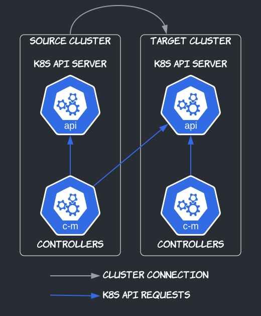
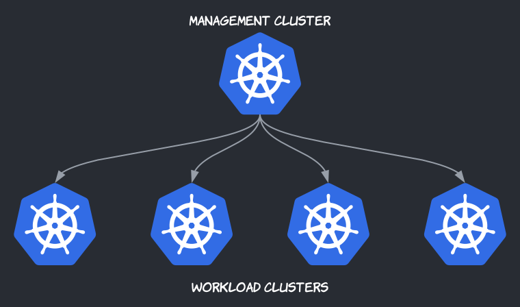
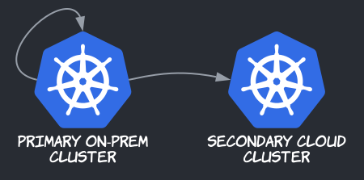
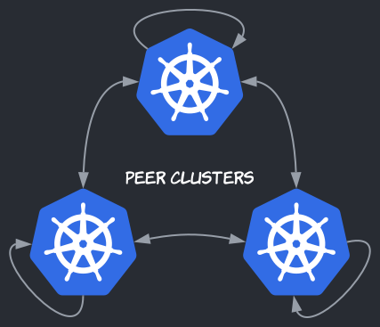

## Cluster Connections

Admiralty connects the control planes of Kubernetes clusters. Two clusters are said to be connected as source and target when controllers in the source cluster (e.g., run by the Admiralty agent) talk to the Kubernetes API of the target cluster. Just like controllers within a single cluster, controllers in either cluster may communicate using the target cluster's Kubernetes API as a message channel.

## Topologies

Clusters and their connections form a [directed graph](https://en.wikipedia.org/wiki/Directed_graph). In particular:

- Saying that cluster A is a source of cluster B is equivalent to saying that cluster B is a target of cluster A.
- Each cluster can be a source and/or a target of multiple clusters.
- Connections can go both ways.
- Clusters can target themselves.

Here are a few typical examples.

### Central Control Plane

This is perhaps the most common topology. A central cluster, often called the management cluster, targets several workload clusters. This topology is useful for many of the use cases listed in [introduction](../introduction.md).

:::note The management cluster is not on the critical path.
If the Admiralty agent in the management cluster or the management cluster itself breaks or loses connectivity with workload clusters, existing pods and services in the workload clusters continue to run and serve requests—if pods are evicted in the meantime, they're even recreated locally by [PodChaperons](./scheduling.md#pod-chaperons)—so your applications stay available. However, to update applications during that time, you'd have to connect to individual clusters, so we strongly recommend having a highly available management cluster (supported by most distributions) and a disaster recovery strategy just in case (e.g. a [Velero](https://velero.io/) backup).
:::

### Cloud Bursting

In this topology, a primary on-prem cluster with fixed resources targets both itself and a secondary cloud-based cluster with elastic resources. Using Kubernetes scheduling preferences (node affinities), Admiralty schedules applications to the primary cluster when resources are available; to the secondary cluster otherwise.

### Decentralized Federation

Organizations in different administrative domains, even different trust domains, managing different clusters, may want to connect their control planes, e.g., to share resources, or to delegate operations, without having to rely on a central cluster owned by a single organization. Admiralty supports this topology, especially useful for academic research platforms, or for vendor-managed deployments.

