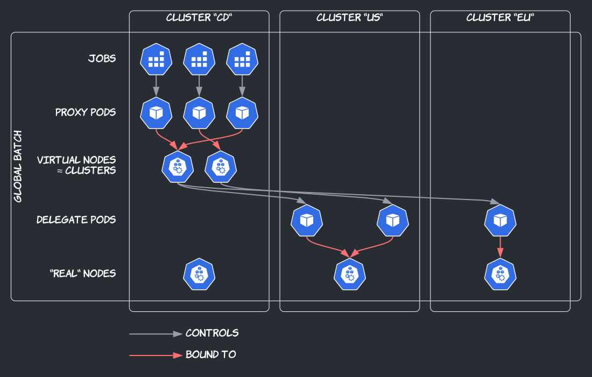
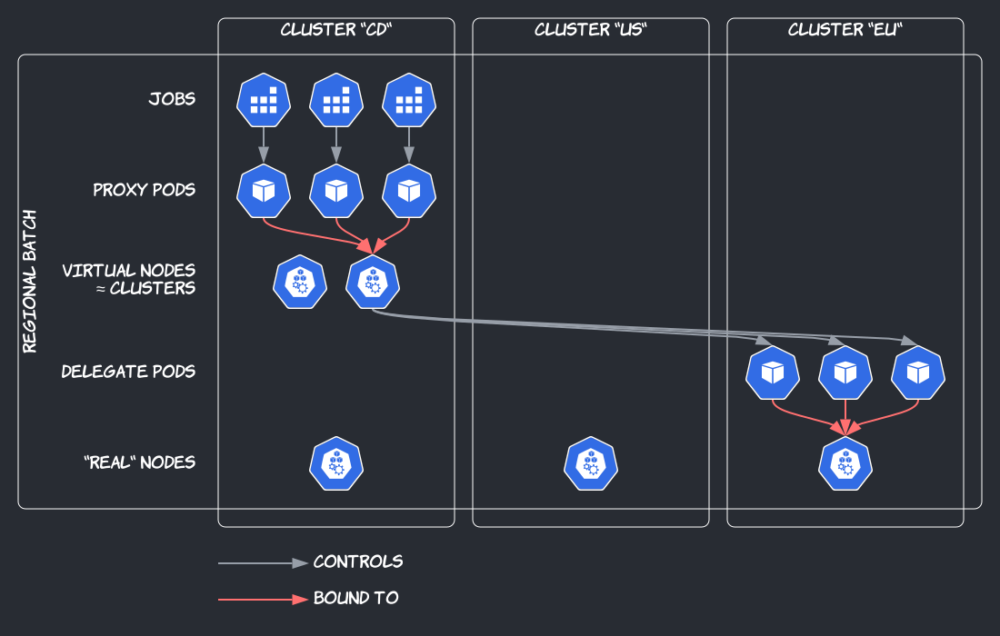

import Tabs from '@theme/Tabs'; import TabItem from '@theme/TabItem';

This guide provides copy-and-paste instructions to try out Admiralty Open Source. We
use [kind](https://kind.sigs.k8s.io/) (Kubernetes in Docker) to create Kubernetes clusters, but feel free to use
something else—though don't just copy and paste instructions then.

## Example Use Case

We're going to model a centralized cluster topology made of a management cluster (named `cd`) where applications are
deployed, and two workload clusters (named `us` and `eu`) where containers actually run. We'll deploy a batch job
utilizing both workload clusters, and another targeting a specific region. If you're interested in
other [topologies](./concepts/topologies.md) or other kinds of applications (e.g., micro-services), this guide is still
helpful to get familiar with Admiralty in general.

<Tabs defaultValue="global"
values={[
{label: 'Global batch', value: 'global'}, {label: 'Regional batch', value: 'regional'},
]}>
<TabItem value="global">



</TabItem>
<TabItem value="regional">



</TabItem>
</Tabs>

## Prerequisites

1.  Install [Helm v3](https://helm.sh/docs/intro/install/) and [kind](https://kind.sigs.k8s.io/docs/user/quick-start#installation) if not already installed.

1.  We recommend you to use a separate kubeconfig for this exercise, so you can simply delete it when you're done:

    ```shell script
    export KUBECONFIG=kubeconfig-admiralty-getting-started
    ```

1.  Create three clusters (a management cluster named `cd` and two workload clusters named `us` and `eu`):

    ```shell script
    for CLUSTER_NAME in cd us eu
    do
      kind create cluster --name $CLUSTER_NAME
    done
    ```

1.  Label the workload cluster nodes as if they were in different regions (we'll use these labels as node selectors):

    ```shell script
    for CLUSTER_NAME in us eu
    do
      kubectl --context kind-$CLUSTER_NAME label nodes --all topology.kubernetes.io/region=$CLUSTER_NAME
    done
    ```

    :::tip
    Most cloud distributions of Kubernetes pre-label nodes with the names of their cloud regions.
    :::

1.  (optional speed-up) Pull images on your machine and load them into the kind clusters. Otherwise, each kind cluster would pull images, which could take three times as long.

    ```shell script
    images=(
      # cert-manager dependency
      quay.io/jetstack/cert-manager-controller:v1.13.1
      quay.io/jetstack/cert-manager-webhook:v1.13.1
      quay.io/jetstack/cert-manager-cainjector:v1.13.1
      # admiralty open source
      public.ecr.aws/admiralty/admiralty-agent:0.17.0
      public.ecr.aws/admiralty/admiralty-scheduler:0.17.0
      public.ecr.aws/admiralty/admiralty-remove-finalizers:0.17.0
      public.ecr.aws/admiralty/admiralty-restarter:0.17.0
    )
    for image in "${images[@]}"
    do
      docker pull $image
      for CLUSTER_NAME in cd us eu
      do
        kind load docker-image $image --name $CLUSTER_NAME
      done
    done
    ```

1.  Install [cert-manager](https://cert-manager.io/) in each cluster:

    ```shell script
    helm repo add jetstack https://charts.jetstack.io
    helm repo update

    for CLUSTER_NAME in cd us eu
    do
      helm install cert-manager jetstack/cert-manager \
        --kube-context kind-$CLUSTER_NAME \
        --namespace cert-manager --create-namespace \
        --version v1.13.1 --set installCRDs=true \
        --wait --debug
      # --wait to ensure release is ready before next steps
      # --debug to show progress, for lack of a better way,
      # as this may take a few minutes
    done
    ```

    :::note
    Admiralty Open Source uses cert-manager to generate a server certificate for its [mutating pod admission webhook](concepts/scheduling.md#proxy-pods).
    :::

## Installation

Install Admiralty in each cluster:

```shell script
for CLUSTER_NAME in cd us eu
do
  helm install admiralty oci://public.ecr.aws/admiralty/admiralty \
    --kube-context kind-$CLUSTER_NAME \
    --namespace admiralty --create-namespace \
    --version 0.17.0 \
    --wait --debug
  # --wait to ensure release is ready before next steps
  # --debug to show progress, for lack of a better way,
  # as this may take a few minutes
done
```

## Configuration

### Cross-Cluster Authentication

1.  Install [jq](https://stedolan.github.io/jq/download/), the command-line JSON processor, if not already installed.

1.  For each workload cluster,

    1. create a Kubernetes service account in the workload cluster for the management cluster,
    1. create a token for it,
    1. get a Kubernetes API address that is routable from the management cluster—here, the IP address of the kind workload cluster's only (master) node container in your machine's shared Docker network,
    1. prepare a kubeconfig using the token and address found above, and the server certificate from your kubeconfig (luckily also valid for this address, not just the address in your kubeconfig),
    1. save the prepared kubeconfig in a secret in the management cluster:

    ```bash
    for CLUSTER_NAME in us eu
    do
      # i.
      kubectl --context kind-$CLUSTER_NAME create serviceaccount cd

      # ii.
      TOKEN=$(kubectl --context kind-$CLUSTER_NAME create token cd)

      # iii.
      IP=$(docker inspect $CLUSTER_NAME-control-plane \
        --format "{{ .NetworkSettings.Networks.kind.IPAddress }}")

      # iv.
      CONFIG=$(kubectl --context kind-$CLUSTER_NAME config view \
        --minify --raw --output json | \
        jq '.users[0].user={token:"'$TOKEN'"} | .clusters[0].cluster.server="https://'$IP':6443"')

      # v.
      kubectl --context kind-cd create secret generic $CLUSTER_NAME \
        --from-literal=config="$CONFIG"
    done
    ```

    :::note Tokens Expire
    Tokens created this way typically expire after an hour. You could create a [token bound to a secret](https://kubernetes.io/docs/tasks/configure-pod-container/configure-service-account/#manually-create-a-long-lived-api-token-for-a-serviceaccount), that would potentially never expire, but we don't recommend it. There are [more secure durable methods](concepts/authentication.md).
    :::

    :::note Other Platforms
    If you're not using kind, your mileage may vary. The Kubernetes API address in your kubeconfig may or may not be routable from other clusters. If not, the server certificate in your kubeconfig may or may not be valid for the routable address that you'll find instead.
    :::

### Multi-Cluster Scheduling

1.  In the management cluster, create a [Target](operator_guide/scheduling.md#targets-and-cluster-targets) for each workload cluster:

    ```shell script
    for CLUSTER_NAME in us eu
    do
      cat <<EOF | kubectl --context kind-cd apply -f -
    apiVersion: multicluster.admiralty.io/v1alpha1
    kind: Target
    metadata:
      name: $CLUSTER_NAME
    spec:
      kubeconfigSecret:
        name: $CLUSTER_NAME
    EOF
    done
    ```

1.  In the workload clusters, create a [Source](operator_guide/scheduling.md#sources-and-cluster-sources) for the management cluster:

    ```shell script
    for CLUSTER_NAME in us eu
    do
      cat <<EOF | kubectl --context kind-$CLUSTER_NAME apply -f -
    apiVersion: multicluster.admiralty.io/v1alpha1
    kind: Source
    metadata:
      name: cd
    spec:
      serviceAccountName: cd
    EOF
    done
    ```

## Demo

1.  Check that virtual nodes have been created in the management cluster to represent workload clusters:

    ```shell script
    kubectl --context kind-cd get nodes --watch
    # --watch until virtual nodes are created,
    # this may take a few minutes, then control-C
    ```

1.  Label the `default` namespace in the management cluster to enable multi-cluster scheduling at the namespace level:

    ```shell script
    kubectl --context kind-cd label ns default multicluster-scheduler=enabled
    ```

1.  Create Kubernetes Jobs in the management cluster, utilizing all workload clusters (multi-cluster scheduling is enabled at the pod level with the `multicluster.admiralty.io/elect` annotation):

    ```shell script {12}
    for i in $(seq 1 10)
    do
      cat <<EOF | kubectl --context kind-cd apply -f -
    apiVersion: batch/v1
    kind: Job
    metadata:
      name: global-$i
    spec:
      template:
        metadata:
          annotations:
            multicluster.admiralty.io/elect: ""
        spec:
          containers:
          - name: c
            image: busybox
            command: ["sh", "-c", "echo Processing item $i && sleep 5"]
            resources:
              requests:
                cpu: 100m
          restartPolicy: Never
    EOF
    done
    ```

1.  Check that [proxy pods](concepts/scheduling.md#proxy-pods) for this job have been created in the management cluster, "running" on virtual nodes, and [delegate pods](concepts/scheduling.md#delegate-pods) have been created in the workload clusters, _actually_ running their containers on _real_ nodes:

    ```shell script
    while true
    do
      clear
      for CLUSTER_NAME in cd us eu
      do
        kubectl --context kind-$CLUSTER_NAME get pods -o wide
      done
      sleep 2
    done
    # control-C when all pods have Completed
    ```

1.  Create Kubernetes Jobs in the management cluster, targeting a specific region with a node selector:

    ```shell script {14-15}
    for i in $(seq 1 10)
    do
      cat <<EOF | kubectl --context kind-cd apply -f -
    apiVersion: batch/v1
    kind: Job
    metadata:
      name: eu-$i
    spec:
      template:
        metadata:
          annotations:
            multicluster.admiralty.io/elect: ""
        spec:
          nodeSelector:
            topology.kubernetes.io/region: eu
          containers:
          - name: c
            image: busybox
            command: ["sh", "-c", "echo Processing item $i && sleep 5"]
            resources:
              requests:
                cpu: 100m
          restartPolicy: Never
    EOF
    done
    ```

1.  Check that proxy pods for this job have been created in the management cluster, and delegate pods have been created in the `eu` cluster only:

    ```shell script
    while true
    do
      clear
      for CLUSTER_NAME in cd us eu
      do
        kubectl --context kind-$CLUSTER_NAME get pods -o wide
      done
      sleep 2
    done
    # control-C when all pods have Completed
    ```

    You may observe transient pending [candidate pods](concepts/scheduling.md#candidate-pods) in the `us` cluster.

## Cleanup

```shell script
for CLUSTER_NAME in cd us eu
do
  kind delete cluster --name $CLUSTER_NAME
done
rm kubeconfig-admiralty-getting-started
```
