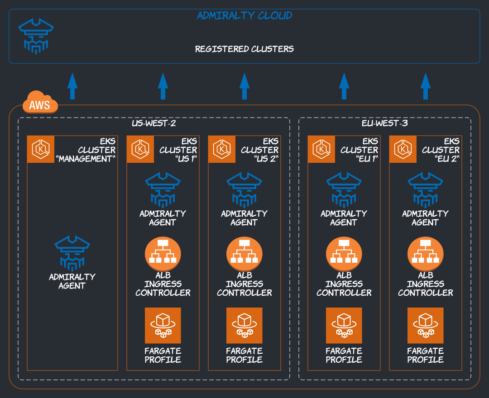
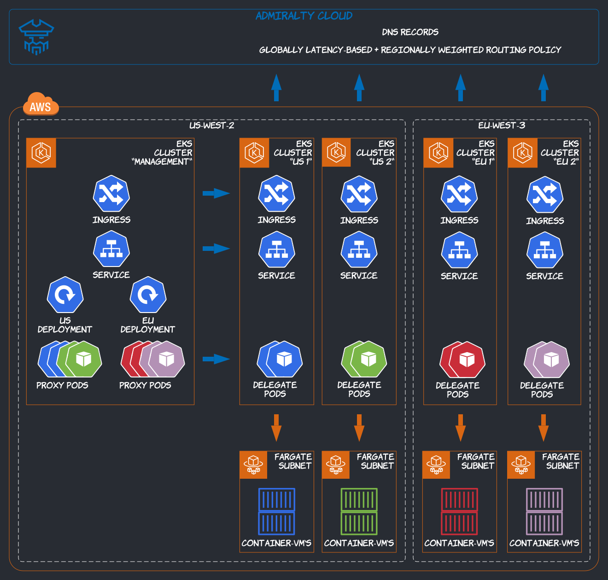

import Tabs from '@theme/Tabs';
import TabItem from '@theme/TabItem';

This tutorial walks you through exposing a global (multi-region) hello-world service using AWS Fargate on EKS, ALB ingress controllers, the Admiralty open source multi-cluster scheduler, and Admiralty Cloud, with copy-paste instructions. For some context, read [the companion article in The New Stack](https://thenewstack.io/making-kubernetes-serverless-and-global-with-aws-fargate-on-eks-and-admiralty/).

## Prerequisites

You'll need the following command line tools:

- the [AWS CLI](https://docs.aws.amazon.com/cli/latest/userguide/cli-chap-install.html) (configured for your account)
- [kubectl](https://docs.aws.amazon.com/eks/latest/userguide/install-kubectl.html)
- [eksctl](https://docs.aws.amazon.com/eks/latest/userguide/eksctl.html)
- [Helm 3](https://docs.aws.amazon.com/eks/latest/userguide/helm.html)
- [jq](https://stedolan.github.io/jq/) (optional)

## Installation

We're going to:

1. provision a management cluster, and four Fargate-enabled workload clusters across two regions with eksctl;
1. install cert-manager (a dependency of Admiralty) and Admiralty in all clusters with Helm and register them with Admiralty Cloud;
1. install the ALB ingress controller in the workload clusters;
1. connect the management cluster to the workload clusters (i.e., configure authentication and scheduling with CRDs);



### Clusters

The script below creates a management cluster and two workload clusters in the us-west-2 (Oregon) region, and two additional workload clusters in the eu-west-3 (Paris) region. The `--fargate` option installs a default Fargate profile for the "default" and "kube-system" namespaces in the workload clusters. We do provision a managed node pool with the `--managed` option in all clusters, because the cert-manager and Admiralty webhooks cannot run on Fargate.

:::tip
We're creating the five clusters asynchronously by sending the `eksctl create cluster` commands to the background with `&`, getting their process IDs right after with `$!`, storing them in an array, and `wait`ing on all of them at the end. Otherwise, provisioning five cluster sequentially could take half an hour. Who needs a workflow engine anyway? We're also building a list of cluster names from region names and indices, to loop through in subsequent steps.
:::

```bash
eksctl create cluster \
  --name management \
  --kubeconfig kubeconfig-management \
  --region us-west-2 \
  --managed &

pids=($!)
cluster_names=(management)

for region in us-west-2 eu-west-3
do
  for i in 0 1
  do
    cluster_name=$region-$i
    eksctl create cluster \
      --name $cluster_name \
      --kubeconfig kubeconfig-$cluster_name \
      --region $region \
      --managed \
      --fargate &

    pids+=($!)
    cluster_names+=($cluster_name)
  done
done

for pid in "${pids[@]}"; do
  wait $pid
done

```

:::note Coffee Break ☕
Even though we're creating the clusters in parallel, creating an EKS cluster still takes a few minutes. It's a good time to read ahead—or make some coffee.
:::

### Cert-Manager

Admiralty uses cert-manager to manage various certificates (for mutating webhooks, authenticating proxies, and cluster identities). Let's install it with Helm in all clusters:

```shell
helm repo add jetstack https://charts.jetstack.io
helm repo update

for cluster_name in "${cluster_names[@]}"
do
  export KUBECONFIG=kubeconfig-$cluster_name
  kubectl create namespace cert-manager
  kubectl apply --validate=false -f https://github.com/jetstack/cert-manager/releases/download/v0.16.1/cert-manager.crds.yaml
  helm install cert-manager jetstack/cert-manager \
    --namespace cert-manager \
    --version v0.16.1
done
```

By default, Helm doesn't wait for releases to be ready, meaning the commands above ran fairly quickly, but we now need to ensure cert-manager's webhook in each cluster is available or Helm could fail to install Admiralty in the next step:

```shell
for cluster_name in "${cluster_names[@]}"
do
  export KUBECONFIG=kubeconfig-$cluster_name
  kubectl wait deploy/cert-manager-webhook \
    --for=condition=available \
    --namespace cert-manager
done
```

### Admiralty

Download the Admiralty CLI if not already installed. We'll use it to register clusters with Admiralty Cloud.

```shell
os=linux # or darwin (i.e., Mac OS X) or windows
arch=amd64 # or arm64, ppc64le, s390x (linux only)
curl -Lo admiralty "https://artifacts.admiralty.io/admiralty-v0.14.0-$os-$arch"
chmod +x admiralty
sudo mv admiralty /usr/local/bin
```

Log in (sign up) to Admiralty Cloud::

```shell
admiralty configure
```

:::note
The `admiralty configure` command takes you through an OIDC log-in/sign-up flow, and eventually saves an Admiralty Cloud API kubeconfig—used to register clusters—and user tokens under `~/.admiralty`.
:::

Install Admiralty in each cluster with Helm:

```shell
helm repo add admiralty https://charts.admiralty.io
helm repo update

for cluster_name in "${cluster_names[@]}"
do
  export KUBECONFIG=kubeconfig-$cluster_name
  kubectl create namespace admiralty
  helm install admiralty admiralty/admiralty \
    --namespace admiralty \
    --version v0.14.0 \
    --set accountName=$(admiralty get-account-name) \
    --set clusterName=$cluster_name
done
```

Register each cluster.

```shell
for cluster_name in "${cluster_names[@]}"
do
  export KUBECONFIG=kubeconfig-$cluster_name
  admiralty register-cluster
done
```

### ALB Ingress Controller

AWS Fargate works best with the ALB ingress controller. Install it in each workload cluster. We've condensed the [official instructions](https://docs.aws.amazon.com/eks/latest/userguide/alb-ingress.html) into one copy-paste-ready script:

```shell
curl -o iam-policy.json https://raw.githubusercontent.com/kubernetes-sigs/aws-alb-ingress-controller/v1.1.8/docs/examples/iam-policy.json
policy_arn="$(aws iam create-policy \
  --policy-name ALBIngressController \
  --policy-document file://iam-policy.json \
  --query Policy.Arn \
  --output text)"

for region in us-west-2 eu-west-3
do
  for i in 0 1
  do
    cluster_name=$region-$i
    export KUBECONFIG=kubeconfig-$cluster_name

    eksctl utils associate-iam-oidc-provider \
      --region $region \
      --cluster $cluster_name \
      --approve

    kubectl apply -f https://raw.githubusercontent.com/kubernetes-sigs/aws-alb-ingress-controller/v1.1.8/docs/examples/rbac-role.yaml

    eksctl create iamserviceaccount \
      --region $region \
      --name alb-ingress-controller \
      --namespace kube-system \
      --cluster $cluster_name \
      --attach-policy-arn $policy_arn \
      --override-existing-serviceaccounts \
      --approve

    vpc_id="$(eksctl get cluster \
      --name=$cluster_name \
      --region=$region \
      --output json | jq -r .[0].ResourcesVpcConfig.VpcId)"

    cat <<EOF | kubectl apply -f -
apiVersion: apps/v1
kind: Deployment
metadata:
  labels:
    app.kubernetes.io/name: alb-ingress-controller
  name: alb-ingress-controller
  namespace: kube-system
spec:
  selector:
    matchLabels:
      app.kubernetes.io/name: alb-ingress-controller
  template:
    metadata:
      labels:
        app.kubernetes.io/name: alb-ingress-controller
    spec:
      containers:
        - name: alb-ingress-controller
          args:
            - --ingress-class=alb
            - --cluster-name=$cluster_name
            - --aws-vpc-id=$vpc_id
            - --aws-region=$region
          image: docker.io/amazon/aws-alb-ingress-controller:v1.1.8
      serviceAccountName: alb-ingress-controller
EOF
  done
done

```

### Configuration

[Kubeconfigs](../operator_guide/authentication.md#kubeconfigs) are matched with [TrustedIdentityProviders](../operator_guide/authentication.md#trusted-identity-providers) across clusters via Admiralty Cloud to authenticate controllers in the management cluster calling the Kubernetes APIs of the workload clusters. [Targets](../operator_guide/scheduling.md#targets-and-cluster-targets) are matched with [Sources](../operator_guide/scheduling.md#sources-and-cluster-sources) to configure scheduling from the management cluster to the workload clusters.

In the management cluster, create a Kubeconfig and a Target for each workload cluster:

```shell script
export KUBECONFIG=kubeconfig-management

for region in us-west-2 eu-west-3
do
  for i in 0 1
  do
    cluster_name=$region-$i

    cat <<EOF | kubectl apply -f -
apiVersion: multicluster.admiralty.io/v1alpha1
kind: Kubeconfig
metadata:
  name: $cluster_name
spec:
  secretName: $cluster_name
  cluster:
    admiraltyReference:
      clusterName: $cluster_name
---
apiVersion: multicluster.admiralty.io/v1alpha1
kind: Target
metadata:
  name: $cluster_name
spec:
  kubeconfigSecret:
    name: $cluster_name
EOF
  done
done
```

In each workload cluster, create a TrustedIdentityProvider and a Source for the management cluster:

```shell script
for region in us-west-2 eu-west-3
do
  for i in 0 1
  do
    cluster_name=$region-$i
    export KUBECONFIG=kubeconfig-$cluster_name

    cat <<EOF | kubectl apply -f -
apiVersion: multicluster.admiralty.io/v1alpha1
kind: TrustedIdentityProvider
metadata:
  name: management
spec:
  prefix: "spiffe://management/"
  admiraltyReference:
    clusterName: management
---
apiVersion: multicluster.admiralty.io/v1alpha1
kind: Source
metadata:
  name: management
spec:
  userName: spiffe://management/ns/default/id/default
EOF
  done
done
```

Check that virtual nodes have been created in the management cluster to represent workload clusters:

```shell script
KUBECONFIG=kubeconfig-management kubectl get nodes --watch
# --watch until virtual nodes are created,
# this may take a moment, then control-C
```

Label the "default" namespace in the management cluster to enable multi-cluster scheduling at the namespace level:

```shell script
KUBECONFIG=kubeconfig-management kubectl label ns default multicluster-scheduler=enabled
```

## Demo

Phew! We could still simplify the installation procedure, but after all you've just provisioned five clusters in two regions, ready to serve global traffic. Now you're about to see how simple Admiralty is to _use_.

We're going to create two regional Deployments, a Service and an Ingress in the management cluster. They'll propagate to the workload clusters and eventually run as Fargate containers connected to ALBs. Admiralty Cloud will configure DNS with smart routing policies to guarantee high availability (HA) and performance.



### Hello World

Create two regional Deployments with 4 replicas each.

- We recommend regional Deployments because, in production, you'll probably want to control scale based on regional throughput. To do that, you would associate a HorizontalPodAutoscaler with each regional Deployment.
- The two Deployments share an `app` label, which will be used as a Service selector (they also have distinctive `region` labels).
- The `multicluster.admiralty.io/elect` template annotation enables multi-cluster scheduling at the pod level. The two other template annotations are required to work with AWS Fargate. Read the note below if you're interested in the algorithm.
- The standard node selector is used to scope each Deployment to a region.
- Each pod running this hello-world application will respond to HTTP requests by printing the name of the Fargate node (micro-VM) it runs on.

:::note

- Fargate uses its own scheduler in the workload clusters, so we can't use Admiralty's candidate scheduler. Admiralty's proxy scheduler usually sends a candidate pod in each target cluster as a way to filter virtual nodes, whether the candidate schedulers reserve actual nodes for the candidate pods or not (cf. [algorithm](../concepts/scheduling.md)). Instead, with the `multicluster.admiralty.io/no-reservation` annotation, we send a single candidate pod per scheduling cycle to the target cluster that scores the highest, and "filter" over multiple cycles until one is scheduled.
- The AWS Fargate scheduler also doesn't consider node selectors, so, with the `multicluster.admiralty.io/use-constraints-from-spec-for-proxy-pod-scheduling` annotation, we tell Admiralty to use our node selector to filter virtual nodes, instead of using it to filter actual nodes in target clusters. Virtual nodes aggregate labels with unique values from target clusters; it's not the full picture, but we can work with it.

:::

```shell script {17-19,24-25}
for region in us-west-2 eu-west-3
do
  cat <<EOF | KUBECONFIG=kubeconfig-management kubectl apply -f -
apiVersion: apps/v1
kind: Deployment
metadata:
  name: hello-world-$region
spec:
  replicas: 4
  selector:
    matchLabels:
      app: hello-world
      region: $region
  template:
    metadata:
      annotations:
        multicluster.admiralty.io/elect: ""
        multicluster.admiralty.io/no-reservation: ""
        multicluster.admiralty.io/use-constraints-from-spec-for-proxy-pod-scheduling: ""
      labels:
        app: hello-world
        region: $region
    spec:
      nodeSelector:
        topology.kubernetes.io/region: $region
      containers:
        - image: adamgolab/hello-world
          name: hello-world
          env:
            - name: PORT
              value: "80"
            - name: WORLD
              valueFrom:
                fieldRef:
                  fieldPath: spec.nodeName
          ports:
            - containerPort: 80
EOF
done
```

Fargate takes about a minute to start pods. Run the following command a few times over a minute to see the multi-cluster scheduling algorithm in action. Eventually, you'll see that [proxy pods](../concepts/scheduling.md#proxy-pods) have been created in the management cluster, "running" on virtual nodes, and [delegate pods](../concepts/scheduling.md#delegate-pods) have been created in the workload clusters, running their containers in _real_ Fargate micro-VMs:

```shell script
for cluster_name in "${cluster_names[@]}"
do
  KUBECONFIG=kubeconfig-$cluster_name kubectl get pods -o wide
done
```

Then, create a Service and Ingress targeting the two Deployments in the management cluster.

:::tip
We use a host name in your Admiralty Cloud account's subdomain, under `admiralty.cloud`. You could configure a CNAME record for each application in your domain, or configure a custom domain in Admiralty Enterprise and an NS record in your domain once and for all.
:::

```shell script {23}
cat <<EOF | KUBECONFIG=kubeconfig-management kubectl apply -f -
apiVersion: v1
kind: Service
metadata:
  name: hello-world
spec:
  ports:
    - port: 80
      targetPort: 80
  selector:
    app: hello-world
---
apiVersion: extensions/v1beta1
kind: Ingress
metadata:
  name: hello-world
  annotations:
    kubernetes.io/ingress.class: alb
    alb.ingress.kubernetes.io/scheme: internet-facing
    alb.ingress.kubernetes.io/target-type: ip
spec:
  rules:
    - host: hello-world.$(admiralty get-account-name).admiralty.cloud
      http:
        paths:
          - path: /*
            backend:
              serviceName: hello-world
              servicePort: 80
EOF
```

Services and Ingresses follow the delegate pods in the workload clusters, and ALB ingress controllers will soon provision load balancers for the Ingresses (the Ingress in the management cluster doesn't have a load balancer because there's no ingress controller in that cluster):

```shell script
for cluster_name in "${cluster_names[@]}"
do
  export KUBECONFIG=kubeconfig-$cluster_name
  kubectl get service hello-world
  kubectl get ingress hello-world
done
```

### Testing Performance

Call your application. Depending on where you are in the world, you'll see a response from a node in Oregon or Paris:

```shell
curl http://hello-world.$(admiralty get-account-name).admiralty.cloud
```

Call from multiple locations and check the latency, e.g., by visiting https://tools.keycdn.com/performance:

<Tabs
groupId="os-only"
defaultValue="linux"
values={[
{label: 'Linux', value: 'linux'},
{label: 'Mac', value: 'mac'},
{label: 'Windows', value: 'windows'},
]
}>
<TabItem value="linux">

```shell script
xdg-open "https://tools.keycdn.com/performance?url=hello-world.$(admiralty get-account-name).admiralty.cloud"
```

</TabItem>
<TabItem value="mac">

```shell script
open "https://tools.keycdn.com/performance?url=hello-world.$(admiralty get-account-name).admiralty.cloud"
```

</TabItem>
<TabItem value="windows">

```shell script
start "https://tools.keycdn.com/performance?url=hello-world.$(admiralty get-account-name).admiralty.cloud"
```

</TabItem>
</Tabs>

### Testing HA

Let's simulate a regional outage (or a failed rollout) by scaling one of the regional Deployments down to 0 replicas, ideally the one closest to you, so you can monitor the failover with curl:

```shell script
KUBECONFIG=kubeconfig-management kubectl scale deploy hello-world-us-west-2 --replicas=0
# scale hello-world-eu-west-3 instead if you're closer to eu-west-3,
# to see the failover to the more distant region

while true
do
  date
  curl -s -m 1 hello-world.$(admiralty get-account-name).admiralty.cloud
  # 1s timeout to not get stuck with a single 504 when the switch happens
  echo # new line after result
  sleep 1
done
# control-C when done
```

Admiralty Cloud uses 1s TTLs, but global DNS record propagation can take up to a minute. In practice, failover usually takes about 10s. That's definitely better than average, but if you need the best, you should consider integrations with anycast load balancers available with Admiralty Enterprise.


For a blue/green cluster upgrade, you would drain a virtual node while the corresponding cluster is being upgraded:

```shell script
KUBECONFIG=kubeconfig-management kubectl drain admiralty-default-eu-west-3-1-8984c76b96
# use `kubectl uncordon` when done with the cluster upgrade
```

## Cleanup

```sh
eksctl delete cluster --name management --region us-west-2
eksctl delete cluster --name us-west-2-0 --region us-west-2
eksctl delete cluster --name us-west-2-1 --region us-west-2
eksctl delete cluster --name eu-west-3-0 --region eu-west-3
eksctl delete cluster --name eu-west-3-1 --region eu-west-3

for cluster_name in "${cluster_names[@]}"
do
  rm kubeconfig-$cluster_name
done
```

## Summary

In this tutorial, we've seen how to integrate Admiralty with AWS Fargate on EKS to deploy a service in multiple regions for high availability and performance. Don't hesitate to [contact us](/contact) if you have any questions about this tutorial or if you're interested in custom domains and/or other load balancing integrations available with Admiralty Enterprise.
