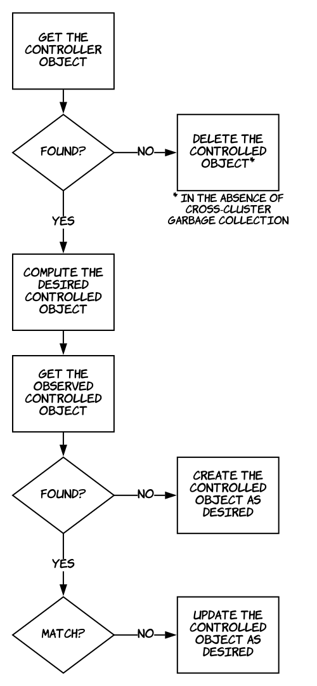

# Multicluster-Controller

Multicluster-controller is a Go library for building Kubernetes controllers that need to watch resources in multiple clusters. It uses the best parts of [controller-runtime](https://github.com/kubernetes-sigs/controller-runtime) (the library powering [kubebuilder](https://github.com/kubernetes-sigs/kubebuilder) and now [operator-sdk](https://github.com/operator-framework/operator-sdk)) and replaces its API (the `manager`, `controller`, `reconcile`, and `handler` packages) to support multicluster operations.

Why? Check out [Admiralty's blog post introducing multicluster-controller](https://admiralty.io/blog/introducing-multicluster-controller/).

## Table of Contents

- [How it Works](#how-it-works)
- [Getting Started](#getting-started)
- [Configuration](#configuration)
- [Usage with Custom Resources](#usage-with-custom-resources)
- [API Reference](#api-reference)

## How it Works

Here is a minimal multicluster controller that watches pods in two clusters. On pod events, it simply logs the pod's cluster name, namespace, and name. In a way, the only thing controlled by this controller is the standard output, but it illustrates a basic scaffold:

```go
package main

import (
  "log"

  "admiralty.io/multicluster-controller/pkg/cluster"
  "admiralty.io/multicluster-controller/pkg/controller"
  "admiralty.io/multicluster-controller/pkg/manager"
  "admiralty.io/multicluster-controller/pkg/reconcile"
  "admiralty.io/multicluster-service-account/pkg/config"
  "k8s.io/api/core/v1"
  "k8s.io/sample-controller/pkg/signals"
)

func main() {
  co := controller.New(&reconciler{}, controller.Options{})

  contexts := [2]string{"cluster1", "cluster2"}
  for _, cx := range contexts {
    cfg, _, err := config.NamedConfigAndNamespace(ctx)
    if err != nil {
      log.Fatal(err)
    }
    cl := cluster.New(ctx, cfg, cluster.Options{})
    if err := co.WatchResourceReconcileObject(cl, &v1.Pod{}, controller.WatchOptions{}); err != nil {
      log.Fatal(err)
    }
  }

  m := manager.New()
  m.AddController(co)

  if err := m.Start(signals.SetupSignalHandler()); err != nil {
    log.Fatal(err)
  }
}

type reconciler struct{}

func (r *reconciler) Reconcile(req reconcile.Request) (reconcile.Result, error) {
  log.Printf("%s / %s / %s", req.Context, req.Namespace, req.Name)
  return reconcile.Result{}, nil
}
```

1. `Cluster`s have arbitrary names. Indeed, Kubernetes clusters are unaware of their names at the moment—apimachinery's `ObjectMeta` struct has a `ClusterName` field, but it ["is not set anywhere right now and apiserver is going to ignore it if set in create or update request."](https://godoc.org/k8s.io/apimachinery/pkg/apis/meta/v1#ObjectMeta)
1. `Cluster`s are configured using regular [client-go](https://github.com/kubernetes/client-go) [rest.Config](https://godoc.org/k8s.io/client-go/rest#Config) structs. They can be created, for example, from [kubeconfig files](https://kubernetes.io/docs/tasks/access-application-cluster/configure-access-multiple-clusters/) or [service account imports](https://admiralty.io/blog/introducing-multicluster-service-account/). We recommend using the [config](https://godoc.org/admiralty.io/multicluster-service-account/pkg/config) package of [multicluster-service-account](https://github.com/admiraltyio/multicluster-service-account) in either case.
1. A `Cluster` struct is created for each kubeconfig context and/or service account import. `Cluster`s hold references to cluster-scoped dependencies: clients, caches, etc. (In controller-runtime, the `Manager` holds a unique set of those.)
1. A `Controller` struct is created, and configured to watch the Pod resource in each cluster. Internally, on each pod event, a reconcile `Request`, which consists of the cluster name, namespace, and name of the pod, is added to the `Controller`'s [workqueue](https://godoc.org/k8s.io/client-go/util/workqueue).
1. `Request`s are to be processed asynchronously by the `Controller`'s `Reconciler`, whose level-based logic is provided by the user (e.g., create controlled objects, call other services).
1. Finally, a `Manager` is created, and the `Controller` is added to it. In multicluster-controller, the `Manager`'s only responsibilities are to start the `Cluster`s' caches, wait for them to sync, then start the `Controller`s. (The `Manager` knows about the caches from the `Controller`s.)

## Getting Started

A good way to get started with multicluster-controller is to run the `helloworld` example, which is more or less the controller presented above in [How it Works](#how-it-works). The other examples illustrate an actual reconciliation logic and the use of a custom resource. Look at their source code, change them to your needs, and refer to the [API documentation](#api-reference) as you go.

### 0. Requirements

You need at least two clusters and a kubeconfig file configured with two contexts, one for each of the clusters. If you already have two clusters/contexts set up, note the **context** names. In this guide, we use "cluster1" and "cluster2" as context names. (If your kubeconfig file contains more contexts/clusters/users, that's fine, they'll be ignored.)

**Important:** if your kubeconfig uses token-based authentication (e.g., GKE by default, or Azure with AD integration), make sure a valid (non-expired) token is cached before you continue. To refresh the tokens, run simple commands like:

```bash
kubectl cluster-info --context cluster1
kubectl cluster-info --context cluster2
```

Note: In production, you wouldn't use your user kubeconfig. Instead, we recommend [multicluster-service-account](https://admiralty.io/blog/introducing-multicluster-service-account/).

If running the manager out-of-cluster, both clusters must be accessible from your machine; in-cluster, assuming you run the manager in cluster1, cluster2 must be accessible from cluster1, or if you run the manager in a third cluster, cluster1 and cluster2 must be accessible from cluster3.

#### (Optional) Creating Two Clusters on Google Kubernetes Engine

Assuming the `gcloud` CLI is installed, you're logged in, a default compute zone and project are set, and the Kubernetes Engine API is enabled in the project, here's a small script to create two clusters and rename their corresponding kubeconfig contexts "cluster1" and cluster2":

```bash
set -e
PROJECT=$(gcloud config get-value project)
REGION=$(gcloud config get-value compute/zone)
for NAME in cluster1 cluster2; do
  gcloud container clusters create $NAME
  gcloud container clusters get-credentials $NAME
  CONTEXT=gke_$PROJECT"_"$REGION"_"$NAME
  sed -i -e "s/$CONTEXT/$NAME/g" ~/.kube/config
  kubectl create clusterrolebinding cluster-admin-binding \
    --clusterrole cluster-admin \
    --user $(gcloud config get-value account)
  kubectl cluster-info # caches a token in kubeconfig
done
```

### 1. Running the Manager

You can run the manager either out-of-cluster or in-cluster.

#### Out-Of-Cluster

Build and run the manager from source:

```bash
go get admiralty.io/multicluster-controller
cd $GOPATH/src/admiralty.io/multicluster-controller
go run examples/helloworld/main.go --contexts cluster1,cluster2
```

Run some other pod from a second terminal, for example:

```bash
kubectl run nginx --image=nginx
```

#### In-Cluster

Save your kubeconfig file as a secret:

```bash
kubectl create secret generic kubeconfig \
  --from-file=config=$HOME/.kube/config
```

Then run a manager pod with the kubeconfig file mounted as a volume, and the `KUBECONFIG` environment variable set to its path:

```bash
cat <<EOF | kubectl create -f -
apiVersion: v1
kind: Pod
metadata:
  name: helloworld
spec:
  containers:
  - env:
    - name: KUBECONFIG
      value: /root/.kube/config
    image: quay.io/admiralty/multicluster-controller-example-helloworld
    name: manager
    args: ["--contexts", "cluster1,cluster2"]
    volumeMounts:
    - mountPath: /root/.kube
      name: kubeconfig
      readOnly: true
  volumes:
  - name: kubeconfig
    secret:
      secretName: kubeconfig
EOF
```

Run some other pod and check the logs:

```bash
kubectl run nginx --image=nginx
kubectl logs helloworld
```

If you cannot trust the pre-built image, you can build your own from source:

```bash
go get admiralty.io/multicluster-controller
cd $GOPATH/src/admiralty.io/multicluster-controller
docker build \
  --file examples/Dockerfile \
  --build-arg target=admiralty.io/multicluster-controller/examples/helloworld \
  --tag $IMAGE .
```

### 2. Understanding the Output

Here is a sample output, showing the system pods when the manager starts, followed by three lines for the nginx pod:

```
2018/10/11 18:53:52 cluster2 / kube-system / kube-dns-5dcfcbf5fb-89ngc
2018/10/11 18:53:52 cluster2 / kube-system / kube-proxy-gke-cluster4-default-pool-cd1af1fa-z5pn
...
2018/10/11 18:53:52 cluster1 / kube-system / kube-dns-autoscaler-69c5cbdcdd-bjn5x
2018/10/11 18:53:52 cluster1 / kube-system / fluentd-gcp-v2.0.17-q8g8x
...
2018/10/11 18:54:28 cluster2 / default / nginx-8586cf59-q59nb
2018/10/11 18:54:28 cluster2 / default / nginx-8586cf59-q59nb
2018/10/11 18:54:34 cluster2 / default / nginx-8586cf59-q59nb
```

When the cache synced, one reconcile request per pod was added to the controller's work queue. They were all different and all were processed. On the other hand, the nginx pod generated six events when it was created: Scheduled, SuccessfulMountVolume, Pulling, Pulled, Created, and Started; see for yourself by running:

```bash
kubectl describe pod nginx | tail -n 10
```

However, only three reconcile requests were processed. Indeed, the requests were all equal (same context, namespace, and name), so while the controller was processing one of them, several others were added to and **grouped** by the work queue before the controller could process another one (pod events can follow each other very quickly). That's normal and it illustrates the [asynchronous and level-based characteristics of the controller pattern](https://admiralty.io/blog/kubernetes-custom-resource-controller-and-operator-development-tools/#the-controller-pattern).

### 3. Further Examples

#### deploymentcopy

The `deploymentcopy` example filters events, watching only the default namespace. Also, it implements an actual reconciliation loop, following the common pattern illustrated in the figure below, where the controller object is an original Deployment in cluster1, and the controlled onject is a copy in cluster2.

Note: Cross-cluster garbage collection is still in the works, so we must delete the controlled object when the controller has disappeared.



To run `deploymentcopy` out-of-cluster:

```bash
go run examples/deploymentcopy/cmd/manager/main.go cluster1 cluster2
```

#### podghost

The `podghost` example's reconciliation logic is similar to `deploymentcopy`'s, but it creates PodGhost objects from Pods, where PodGhost is a custom resource (see below, [Usage with Custom Resources](#usage-with-custom-resources)).

The PodGhost custom resource definition (CRD) must be created in "cluster2" before running the manager:

```bash
kubectl create -f examples/podghost/kustomize/crd.yaml \
  --context cluster2
```

Then, out-of-cluster:

```bash
go run examples/podghost/cmd/manager/main.go cluster1 cluster2
```

## Usage with Custom Resources

The Kubernetes controller pattern is often used in conjunction with [custom resources](https://kubernetes.io/docs/concepts/extend-kubernetes/api-extension/custom-resources/). To use multicluster-controller with a custom resource, we need two things:
1. a custom resource definition (CRD), and
2. API code for the custom resource.

### Custom Resource Definition

Reminder: CustomResourceDefinition is itself a Kubernetes resource. A custom resource's schema can be defined by creating a CRD object, which specifies an API group (e.g., `multicluster.admiralty.io`), version (e.g., `v1alpha1`), kind (e.g., `PodGhost`), OpenAPI validation rules, [among other things](https://kubernetes.io/docs/tasks/access-kubernetes-api/custom-resources/custom-resource-definitions/).

There's nothing special about multicluster-controller in this regard. Just don't forget to create your CRDs in all of the clusters that need them.

### Custom API Code

You need to define a struct for the custom resource (e.g., PodGhost), a corresponding List struct (e.g., PodGhostList), with proper json field tags, and DeepCopy methods. The structs must be registered with the [scheme](https://godoc.org/github.com/kubernetes/client-go/kubernetes/scheme) used for the `Cluster`s at run time. Setting up those things manually is cumbersome and error-prone.

Luckily, [there are tools to help us](https://admiralty.io/blog/kubernetes-custom-resource-controller-and-operator-development-tools/). You could copy-paste and modify the structs from [sample-controller](https://github.com/kubernetes/sample-controller) and use [code-generator](https://github.com/kubernetes/code-generator) to generate the DeepCopy methods. You can also leverage the scaffolding of [operator-sdk](https://github.com/operator-framework/operator-sdk) or [kubebuilder](https://github.com/kubernetes-sigs/kubebuilder).

In the end, don't forget to register the structs with the scheme, as in this snippet [from the `podghost` example](examples/podghost/pkg/controller/podghost/podghost_controller.go):

```go
if err := apis.AddToScheme(ghostCluster.GetScheme()); err != nil {
  return nil, err
}
```

#### Using operator-sdk 0.0.7

```bash
operator-sdk new foo \
  --api-version multicluster.admiralty.io/v1alpha1 \
  --kind Foo
```

You would then rewrite `cmd/foo/main.go` and `pkg/apis/stub/handler.go` for multicluster-scheduler. Note that `operator-sdk new` creates a lot of other files that you may or may not need.

#### Using kubebuilder 1.0.4

We only care about the `kubebuilder create api` subcommand of `kubebuilder`, but unfortunately it requires files created by `kubebuilder init`, namely:
- `hack/boilerplate.go.txt`, the copyright and license notice to use as a header in generated files,
- and `PROJECT`, which contains metadata such as kubebuilder's major version number, the custom API's domain, and the package's import path.

You can either create only those two files (option 1) or run `kubebuilder init` and delete a bunch of files you don't need (option 2).

##### Option 1

```bash
echo '/*
Copyright 2018 The Multicluster-Controller Authors.

Licensed under the Apache License, Version 2.0 (the "License");
you may not use this file except in compliance with the License.
You may obtain a copy of the License at

    http://www.apache.org/licenses/LICENSE-2.0

Unless required by applicable law or agreed to in writing, software
distributed under the License is distributed on an "AS IS" BASIS,
WITHOUT WARRANTIES OR CONDITIONS OF ANY KIND, either express or implied.
See the License for the specific language governing permissions and
limitations under the License.
*/' > hack/boilerplate.go.txt

echo 'version: "1"
domain: admiralty.io
repo: admiralty.io/foo' > PROJECT

kubebuilder create api \
  --group multicluster \
  --version v1alpha1 \
  --kind Foo \
  --controller=false \
  --make=false

go generate ./pkg/apis # runs k8s.io/code-generator/cmd/deepcopy-gen/main.go
```

##### Option 2

```bash
kubebuilder init \
  --domain admiralty.io \
  --owner "The Multicluster-Controller Authors"

kubebuilder create api \
  --group multicluster \
  --version v1alpha1 \
  --kind Foo \
  --controller=false
  # calls make, which calls go generate

rm pkg/controller/controller.go
# and rewrite cmd/manager/main.go
```

## API Reference

https://godoc.org/admiralty.io/multicluster-controller/

or

```bash
go get admiralty.io/multicluster-controller
godoc -http=:6060
```

then http://localhost:6060/pkg/admiralty.io/multicluster-controller/
